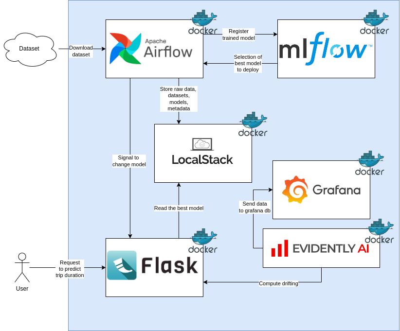

# Predicting Taxi Trip Duration in New York City Using Machine Learning and MLOps

## 1. Problem Statement

Accurately predicting the duration of taxi trips in New York City is a complex task due to the city's dynamic traffic conditions, diverse weather patterns, and varying demand levels. Traditional methods of estimation often fall short in providing reliable predictions, leading to inefficiencies for both passengers and taxi services. A robust solution is needed to handle the multifaceted nature of these trips and provide accurate duration predictions.

### 1.1. Proposed Solution: Machine Learning Models

Machine learning (ML) models offer a powerful solution to this problem. By leveraging historical trip data and other relevant factors, these models can learn to predict the duration of future trips with a higher degree of accuracy. The ability to incorporate various features such as pickup and drop-off locations, time of day, day of the week, weather conditions, and traffic data makes ML models particularly well-suited for this task.

### 1.2. Available Dataset: TLC Trip Record Data

To develop and train these machine learning models, we can use the **TLC Trip Record Data**. This dataset is provided by the New York City Taxi and Limousine Commission (TLC) and includes detailed records of taxi trips in the city. The dataset contains features such as pickup and drop-off dates and times, locations, trip distances, and fare amounts, among others. This rich dataset provides a comprehensive foundation for training models to predict trip durations accurately.

### 1.3. Importance of MLOps in Managing Model Lifecycle

Implementing MLOps (Machine Learning Operations) is crucial in managing the lifecycle of these machine learning models. MLOps practices help automate and streamline the processes of deploying, monitoring, and updating models. Given the ever-changing nature of traffic patterns, road conditions, and other external factors, models must be regularly updated to maintain their accuracy. MLOps ensures that these updates can be made efficiently and reliably, minimizing the risk of deploying outdated models.

### 1.4. Advantages of Applying Machine Learning and MLOps

Applying machine learning to predict taxi trip durations offers several advantages, including improved accuracy in predictions, enhanced user satisfaction, and optimized fleet management for taxi services. Additionally, the application of MLOps provides significant benefits by keeping these models up to date. Without MLOps, models risk becoming obsolete, leading to decreased accuracy and potentially negative impacts on service quality. With MLOps, continuous integration and deployment processes ensure that models are consistently retrained and fine-tuned in response to new data, preserving their effectiveness over time.

Leveraging machine learning models and adopting MLOps practices is key to addressing the challenge of predicting taxi trip durations in New York City. This approach not only enhances the precision of predictions but also ensures the sustainability and relevance of the models in a dynamic environment.

### Description of solution

For this project, various tools were utilized to build and manage the different components:

- **Python** was the primary language used for developing most elements, such as the Airflow DAGs and the Flask API.
- **Airflow** was employed to construct pipelines for task orchestration.
- **Pandas** and **PyArrow** were used for data management during the training process.
- The models were developed using **Scikit-learn (sklearn)**.
- Model metrics were also calculated using **Scikit-learn**.
- **MLflow** was used to track experiments and manage model registration.
- **Flask** was used to develop an API, allowing the best model (based on RMSE) to be deployed and used for predicting trip durations.
- **Pytest** and **Unittest** were employed to build unit and integration tests to evaluate the API.
- The applications were containerized using **Docker** to facilitate deployment and potential migration to the cloud.
- **Pylint**, **isort**, and **Black** were used to improve the quality of the written code.
- A **Makefile** was used to organize the deployment steps.
- **LocalStack** to store dataset, models and metadata.


_____________________________

## 2. Reproducibility:

### 2.1. Instructions to Start the Project

1. **Clone the Project Repository:**
   If you haven't already, clone the project repository to your local machine:
   ```bash
   git clone https://github.com/jelambrar96-datatalks/mlops-zoomcamp-project
   cd mlops-zoomcamp-project
   ```

2. **Set Up the Environment:**
   Ensure the `.env` file is in the project root directory. This file contains all the necessary environment variables. If it’s not already created, create it and copy the content provided above into the file.

   This is a example of `.env` file.

```bash
### ENV VARIABLES
PROJECT_NAME="mlops-zoomcamp"

### FOR LOCALSTACK
AWS_ACCESS_KEY_ID=your_access_key_id
AWS_SECRET_ACCESS_KEY=your_secret_access_key
AWS_DEFAULT_REGION=us-east-1

S3_BUCKET_NAME="${PROJECT_NAME}-bucket"

### FOR AIRFLOW
AIRFLOW_IMAGE_NAME="apache/airflow:2.9.3"
AIRFLOW_UID=1000
AIRFLOW_PROJ_DIR="./airflow"
_AIRFLOW_WWW_USER_USERNAME="airflow"
_AIRFLOW_WWW_USER_PASSWORD="airflow"
_PIP_ADDITIONAL_REQUIREMENTS="boto3==1.34.131 localstack==3.6.0 mlflow==2.15.1 numpy==1.26.4 pandas==2.1.4 pyarrow==15.0.2 requests==2.32.3 scikit-learn==1.5.1 s3fs==2024.6.1"

AIRFLOW_START_TIME="2023-01-01"

# MLFLOW
MLFLOW_PORT=5001
MLFLOW_POSTGRES_USER=mlflow
MLFLOW_POSTGRES_PASS=mlflow
MLFLOW_BUCKET=mlflow-bucket

# GRAFANA
GRAFANA_PORT=3000
GRAFANA_POSTGRES_USER=grafana
GRAFANA_POSTGRES_PASS=grafana
``` 

3. **Build the Docker Images:**
   Some services require building Docker images from custom Dockerfiles. Use the following command to build those images:
   ```bash
   docker-compose build
   ```

4. **Start the Docker Containers:**
   To start all the services defined in the `docker-compose.yml` file, run:
   ```bash
   docker-compose up -d
   ```
   The `-d` flag runs the containers in detached mode, meaning they will run in the background.

5. **Verify All Services Are Running:**
   Use the following command to list all running containers and verify that everything started correctly:
   ```bash
   docker-compose ps
   ```

### 2.2. Available Applications and Ports on Host

Once the project is running, the following applications will be available on your host:

1. **Airflow Webserver:**
   - **URL:** `http://localhost:8081`
   - **Port:** 8081

2. **Flower (Celery Monitoring Tool):**
   - **URL:** `http://localhost:5555`
   - **Port:** 5555

3. **Mlflow Tracking Server:**
   - **URL:** `http://localhost:5001`
   - **Port:** 5001

4. **Grafana Dashboard:**
   - **URL:** `http://localhost:3000`
   - **Port:** 3000

5. **Flask Application:**
   - **URL:** `http://localhost:8000`
   - **Port:** 8000

### 2.3. Notes

- Ensure Docker and Docker Compose are installed on your machine before running these commands.
- If any service fails to start, check the logs using `docker-compose logs <service_name>`.
- You can stop all services by running `docker-compose down`, which will also remove the containers.

_____________________________

## 3. NO-cloud used, but `localstack` and `docker-compose` impleplemented

To address the problem of predicting taxi trip durations through MLOps, a decision was made to implement a solution that runs locally rather than in the cloud. This local deployment approach offers several key advantages:

### 3.1. Advantages of Local Development

1. **Cost Efficiency**: Running the solution locally eliminates the need for cloud infrastructure costs, such as pay-per-use charges and data transfer fees. This can result in significant savings, especially during the development and testing phases.

2. **Improved Control and Security**: Local deployment provides greater control over the environment, allowing for more stringent security measures and easier access management. Developers can have direct oversight of the entire infrastructure, reducing potential vulnerabilities associated with cloud environments.

3. **Faster Iteration**: Working locally can lead to faster iteration cycles, as developers don't need to rely on internet connectivity or deal with cloud service latency. This speed can be particularly beneficial during the initial stages of model development and testing.

4. **Custom Environment Configuration**: A local setup allows for highly customized configurations tailored specifically to the project’s needs. Developers can tweak settings and optimize performance without being constrained by the limitations or default configurations of cloud services.

### 3.2. Containerized Infrastructure with Docker and Docker Compose

Despite being a local solution, Docker and Docker Compose were used to build a container-based infrastructure. This approach enables the entire environment to be packaged into containers, making it portable and consistent across different development machines. The use of Docker ensures that the solution can be easily scaled to the cloud if needed in the future. Docker Compose simplifies the orchestration of these containers, allowing for a streamlined and efficient setup of complex multi-container applications.

### 3.3. LocalStack for Simulated Cloud Storage

Although the solution does not utilize the cloud, LocalStack was implemented to simulate cloud services for data storage. LocalStack mimics the behavior of AWS S3 buckets, allowing developers to work with cloud-like storage services directly from their local environment. This ensures that the transition to a full cloud deployment can be seamless, as the local development environment closely mirrors the cloud infrastructure.

_______________________________________________________________________________

## 4. Experiment tracking and model registry with `mlflow`

For experiment tracking and model registry, **MLflow** was utilized throughout the project. The primary goal was to build a machine learning model capable of predicting taxi trip durations based on several key features, including trip distance, pickup and drop-off locations, day of the week, and time of day.

In this process, the following machine learning regression models were registered using MLflow:

1. **Linear Regression**
2. **Lasso Regression**
3. **Gradient Boosting**
4. **Random Forests**

For each model, the following performance metrics were tracked and stored:

- **Root Mean Squared Error (RMSE)**
- **Mean Squared Error (MSE)**
- **Mean Absolute Error (MAE)**
- **R-squared (R²)**

These metrics provided a comprehensive evaluation of the models' accuracy and effectiveness in predicting taxi trip durations, enabling an informed selection of the best-performing model for deployment.


_______________________________________________________________________________

## 5. Workflow orchestration with airflow

For workflow orchestration, **Airflow** was implemented to manage and automate the various processes involved in the project. Airflow offers several advantages in workflow orchestration:

### Advantages of Airflow in Workflow Orchestration

1. **Scalability**: Airflow can handle complex workflows involving large-scale data processing. It allows for the creation of Directed Acyclic Graphs (DAGs) that can be scaled as needed, whether running on a single machine or distributed across a cluster.

2. **Flexibility**: Airflow provides the flexibility to define workflows in Python, making it easy to integrate with existing codebases and customize workflows according to specific project requirements.

3. **Robust Scheduling**: With Airflow, tasks can be scheduled to run at specific times or triggered based on dependencies. This ensures that processes are executed in the correct order and without manual intervention.

4. **Monitoring and Logging**: Airflow includes built-in monitoring and logging features, which allow for real-time tracking of workflow execution, making it easier to identify and resolve issues promptly.

### Implemented DAGs

Three main DAGs were implemented to manage the end-to-end process:

1. **`dag01_download_data`**: 
   - **Purpose**: This DAG is responsible for downloading the NYC taxi dataset, applying necessary filtering processes, and storing the cleaned data files within LocalStack. This step ensures that the data is prepared and available for model training.


2. **`dag02_training`**: 
   - **Purpose**: This DAG is used to build the dataset, train the machine learning models, and register the trained models in MLflow. It automates the entire training pipeline, ensuring consistency and repeatability across model versions.


1. **`dag03_deploy`**: 
   - **Purpose**: This DAG selects the model with the best Root Mean Squared Error (RMSE) from the models registered in MLflow. It then uploads the selected model to an S3 bucket simulated by LocalStack, where it can be accessed by a Flask application for making predictions.


By leveraging Airflow for workflow orchestration, the project benefits from automated, reliable, and scalable management of data processing, model training, and deployment processes. This approach ensures that each step is executed efficiently and in the correct sequence, facilitating the seamless integration of machine learning models into the production environment.

_______________________________________________________________________________

## 6. Model deployment with flask

A Flask API was designed to load the best-performing model stored in S3. This model is then used to predict the duration of taxi trips based on the time of day and the pickup and drop-off locations.

### 6.1. Advantages of Combining Flask with Machine Learning Applications

One of the key advantages of using Flask is its ease of integration with Python-based machine learning applications. Flask is lightweight, flexible, and allows developers to quickly set up web applications that can interact with machine learning models. This combination enables seamless deployment of predictive models, allowing for real-time inference through a simple and efficient web interface.

### 6.2. API Functionality

The Flask API is capable of the following:

- **Loading the Best Model**: The API automatically loads the best model, selected based on the lowest RMSE, from the S3 bucket, when applicantion receive a POST to `/reload` path. 
- **Predicting Trip Duration**: Given inputs such as the time of day and the starting and ending locations of a taxi trip, the API processes these inputs through the model to predict the expected trip duration. Application uses `/predict` path to send predicion when a POST method is used. 

This setup ensures that the machine learning model can be accessed and utilized in a production environment, providing accurate and timely predictions for end users.

This is a small code from `app.py`

```python

@app.route('/reload', methods=['POST'])
def reload_endpoint():
    """
    Reload the model and vectorizer via an API call.

    Returns:
        Response: JSON response indicating success or failure of the reload operation.
    """
    flag = model_loader.reload()
    if flag:
        return jsonify({"result": "success", "reloaded": True})
    return jsonify({"result": "failed", "reloaded": False})

@app.route('/predict', methods=['POST'])
def predict_endpoint():
    """
    Predict outcomes using the loaded model via an API call.

    Returns:
        Response: JSON response containing the predictions.
    """
    ride = request.get_json()["data"]
    features = prepare_features(ride)
    pred = model_loader.predict(features)
    result = "failed"
    if pred is not None:
        result = "success"
    return jsonify({"result": result, "predictions": pred})

```

_______________________________________________________________________________

## 7. Model monitoring with grafana, prefect and evidently (Not-YET)


_______________________________________________________________________________

## 8. Best practices 

### 8.1. Unit test to model deployment

```plain
flask/
├── app.py
├── test_app.py
└── test_requests.py
```
#### 8.1. `test_app.py`

```python
# test_app.py
import unittest
from app import app

class AppTestCase(unittest.TestCase):
    def setUp(self):
        # Set up the test client
        self.app = app.test_client()
        self.app.testing = True

    def test_reload_route(self):
        # Test the /reload route
        response = self.app.post('/reload')
        self.assertEqual(response.status_code, 200)
        self.assertIn('reloaded', response.get_json()['status'])

    def test_predict_route(self):
        # Test the /predict route
        test_data = {'feature1': 1, 'feature2': 2}
        response = self.app.post('/predict', json=test_data)
        self.assertEqual(response.status_code, 200)
        self.assertIn('prediction', response.get_json())

if __name__ == '__main__':
    unittest.main()
```

1. **Setup Test Client:**
   - `self.app = app.test_client()` creates a test client for the Flask app. This client can be used to send requests to the app's routes during testing.
   - `self.app.testing = True` ensures that Flask's error handling behaves as expected during tests.

2. **Test `/reload` Route:**
   - `response = self.app.post('/reload')` sends a POST request to the `/reload` route.
   - `self.assertEqual(response.status_code, 200)` checks that the response status code is 200 (OK).
   - `self.assertIn('reloaded', response.get_json()['status'])` verifies that the response JSON contains the expected "reloaded" status.

3. **Test `/predict` Route:**
   - `response = self.app.post('/predict', json=test_data)` sends a POST request to the `/predict` route with a JSON payload.
   - `self.assertEqual(response.status_code, 200)` checks that the response status code is 200 (OK).
   - `self.assertIn('prediction', response.get_json())` checks that the response JSON contains a "prediction" key.

### Running the Test:
You can run the test by executing the following command in your terminal:

```bash
python -m unittest test_app.py
```

This will run the unit tests and provide output indicating whether the routes are functioning as expected.


### 8.2. Integration test to model deployment 

#### 8.1. `test_requests.py`

- **Purpose**: This file contains a tests for a web service's endpoints using the `unittest` framework.

- **Tests**:
  - **`test_index`**: Tests the index endpoint (`GET /`). The test checks if the response status code is 200.
  - **`test_01_reload`**: Tests the reload endpoint (`POST /reload`). It checks if the status code is 200 and if the response JSON contains `"result": "success"`.
  - **`test_02_predict`**: Tests the predict endpoint (`POST /predict`).
    - The test fetches a small sample of Parquet data using the `get_parquet_files` function.
    - The data is preprocessed (replacing NaN values and formatting datetime fields).
    - The data is then sent as a JSON payload to the predict endpoint.
    - The test checks if the response contains `"result": "success"`.

This is a fragment taken from `test_requests.py`

```python
class RequestsTest(unittest.TestCase):
    """
    Unit tests for the web service endpoints.
    """

    def test_index(self):
        """
        Test the index endpoint.
        """
        req = requests.get("http://localhost:8000", timeout=10)
        if req.status_code != 200:
            raise ValueError(f"Invalid status code {req.status_code}")

    def test_01_reload(self):
        """
        Test the reload endpoint.
        """
        req = requests.post("http://localhost:8000/reload", timeout=30)
        if req.status_code != 200:
            raise ValueError(f"Invalid status code {req.status_code}")
        if req.json()["result"] != "success":
            raise ValueError("Invalid response")

    def test_02_predict(self):
        """
        Test the predict endpoint.
        """
        df = get_parquet_files(
            type_tripdata="yellow",
            start_datetime=datetime.strptime("2024-01-01", "%Y-%m-%d"),
            end_datetime=datetime.now(),
            bucket_name=S3_BUCKET_NAME,
            s3_object=s3_client,
            sample=1
        )
        df.replace('nan', np.nan, inplace=True)
        df.replace(np.nan, 0, inplace=True)
        df["pickup_datetime"] = df["pickup_datetime"].apply(lambda x: x.strftime("%Y-%m-%d %H:%M:%S")) # pylint: disable=line-too-long
        df["dropoff_datetime"] = df["dropoff_datetime"].apply(lambda x: x.strftime("%Y-%m-%d %H:%M:%S")) # pylint: disable=line-too-long
        json_df = df.to_dict(orient="records")
        json_data = {
            "data": json_df
        }
        req = requests.post(
            url="http://localhost:8000/predict",
            json=json_data,
            timeout=30
        )
        if req.json()["result"] != "success":
            raise ValueError("Invalid response")
```

### 8.3. Linter and formater code 

To improve the quality and readability of the Python code, the packages **pylint**, **black**, and **isort** were implemented. Each of these tools serves a specific purpose in maintaining clean, well-structured, and consistent code.

#### 8.3.1. Pylint

**Pylint** is a static code analysis tool that checks for errors in Python code, enforces coding standards, and detects code smells. It examines the code for issues such as unused variables, incorrect function arguments, and non-compliant naming conventions. Pylint assigns a score to the code based on its adherence to best practices, making it easier for developers to identify areas that need improvement.

#### 8.3.2. Black

**Black** is an opinionated code formatter that automatically reformats Python code to conform to a consistent style. By following the PEP 8 guidelines, Black ensures that code is uniformly structured across a project, reducing the likelihood of stylistic discrepancies. It operates by reformatting the entire file rather than only the modified sections, which simplifies the code review process and helps maintain a consistent style.

#### 8.3.3. Isort

**Isort** is a tool that automatically sorts and organizes import statements in Python files. It arranges imports into groups (standard library, third-party packages, local imports) and orders them alphabetically within each group. By maintaining a clean and organized import structure, Isort helps prevent import conflicts and improves code readability.

#### 8.3.4. Combined Benefits

By integrating **Pylint**, **Black**, and **Isort** into the development workflow, the project benefits from enhanced code quality, consistency, and maintainability. Pylint ensures that the code adheres to best practices, Black standardizes formatting across the codebase, and Isort keeps imports tidy and organized. This combination results in cleaner, more readable, and more reliable Python code.

### 8.4. Pre-commit hooks

```yaml
# See https://pre-commit.com for more information
# See https://pre-commit.com/hooks.html for more hooks
repos:
- repo: https://github.com/pre-commit/pre-commit-hooks
  rev: v3.2.0
  hooks:
    - id: trailing-whitespace
    - id: end-of-file-fixer
    - id: check-yaml
    - id: check-added-large-files
- repo: https://github.com/pycqa/isort
  rev: 5.10.1
  hooks:
    - id: isort
      name: isort (python)
- repo: https://github.com/psf/black
  rev: 22.6.0
  hooks:
    - id: black
      language_version: python3.9
- repo: local
  hooks:
    - id: pylint
      name: pylint
      entry: pylint
      language: system
      types: [python]
      args: [
        "-rn", # Only display messages
        "--recursive=y",
        "airflow/dags/*.py"
      ]
```

This `pre-commit-config.yaml` file is a configuration file for the [pre-commit](https://pre-commit.com/) tool, which is used to manage and run linters and other code quality tools before code is committed to a version control system, like Git. Below is an explanation of the different parts of the file:

#### 8.4.1. Overall Structure
- The file defines a set of repositories (`repos`) that contain hooks.
- Each hook specifies a tool or a script that will be run on the code before it's committed.
- The hooks are run in the order they are listed in the file.

#### 8.4.2. Repositories and Hooks

1. **Pre-commit Hooks from `pre-commit-hooks` Repository**
   - **Repository:** `https://github.com/pre-commit/pre-commit-hooks`
   - **Version:** `v3.2.0`
   - **Hooks:**
     - **`trailing-whitespace`:** Removes trailing whitespace in files.
     - **`end-of-file-fixer`:** Ensures that files end with exactly one newline.
     - **`check-yaml`:** Validates YAML files to ensure they are correctly formatted.
     - **`check-added-large-files`:** Prevents adding large files to the repository (by default, files larger than 500kB).

2. **Isort Hook from `pycqa/isort` Repository**
   - **Repository:** `https://github.com/pycqa/isort`
   - **Version:** `5.10.1`
   - **Hook:**
     - **`isort`:** Automatically sorts imports in Python files according to PEP8 standards.

3. **Black Hook from `psf/black` Repository**
   - **Repository:** `https://github.com/psf/black`
   - **Version:** `22.6.0`
   - **Hook:**
     - **`black`:** A code formatter for Python that formats Python code to be consistent with PEP8. 
     - **`language_version: python3.9`:** Specifies that Black should run using Python 3.9.

4. **Local Hook for `pylint`**
   - **Repository:** `local`
   - **Hook:**
     - **`id: pylint`:** Runs `pylint`, a Python code analyzer.
     - **`name: pylint`:** Specifies the name of the hook.
     - **`entry: pylint`:** The command to be executed.
     - **`language: system`:** Indicates that the hook uses a system-installed tool rather than a Python package managed by `pre-commit`.
     - **`types: [python]`:** Specifies that this hook should only run on Python files.
     - **`args`:**
       - **`"-rn"`:** Only display messages (no full report).
       - **`"airflow/dags/*.py"`:** Check this files.

#### 8.4.3. Summary
- This configuration sets up various tools to automatically enforce code quality and style guidelines whenever a commit is made.
- `pre-commit-hooks` provides general-purpose hooks for common issues like trailing whitespace or improperly formatted YAML files.
- `isort` and `black` are specific to Python and help maintain consistent import ordering and code formatting, respectively.
- `pylint` is also Python-specific and provides static analysis to catch potential issues in the code.


### 8.5. Makefile 

```makefile
LOCAL_TAG:=$(shell date +"%Y-%m-%d-%H-%M")

test:
	pytest flask/test_app.py

quality_checks:
	isort flask/*.py
	isort airflow/dags/*.py
	black flask/*.py
	black airflow/dags/*.py
	pylint flask/*.py
	pylint airflow/dags/*.py

build: quality_checks test
	docker compose --env-file .env build

integration_test: build
	bash flask/test_requests.sh

setup:
	pre-commit install
```

This `Makefile` is designed to automate various tasks involved in developing and maintaining a project, likely a Python-based application that includes Flask and Airflow components. Below is an explanation of each part of the `Makefile`:

#### 8.5.1. `LOCAL_TAG`
```makefile
LOCAL_TAG:=$(shell date +"%Y-%m-%d-%H-%M")
```
- **Purpose**: This variable captures the current date and time, formatted as `YYYY-MM-DD-HH-MM`.
- **Use Case**: This tag can be useful for versioning builds or Docker images with a timestamp, though it is not explicitly used in the tasks below.

#### 8.5.2. `test`
```makefile
test:
	pytest flask/test_app.py
```
- **Purpose**: This target runs unit tests located in `flask/test_app.py` using `pytest`.
- **Use Case**: Use this target to ensure that the Flask application is functioning correctly by running the test suite.

#### 8.5.3. `quality_checks`
```makefile
quality_checks:
	isort flask/*.py
	isort airflow/dags/*.py
	black flask/*.py
	black airflow/dags/*.py
	pylint flask/*.py
	pylint airflow/dags/*.py
```
- **Purpose**: This target runs code quality and formatting checks across the project.
  - **isort**: Sorts and organizes import statements in all `.py` files within the `flask/` and `airflow/dags/` directories.
  - **black**: Formats the Python code in these directories to follow a consistent style.
  - **pylint**: Analyzes the code for errors, enforcing coding standards and best practices.
- **Use Case**: Run this target to clean up code formatting and identify any issues before proceeding to further steps like building or testing.

#### 8.5.4. `build`
```makefile
build: quality_checks test
	docker compose --env-file .env build
```
- **Purpose**: This target builds Docker images using `docker compose`.
  - **Dependencies**: It first runs the `quality_checks` and `test` targets to ensure code quality and test correctness before building.
  - **--env-file .env**: Uses environment variables defined in the `.env` file during the build process.
- **Use Case**: Run this target to build Docker images for the application, ensuring that only high-quality, tested code is packaged.

#### 8.5.5. `integration_test`
```makefile
integration_test: build
	bash flask/test_requests.sh
```
- **Purpose**: This target runs integration tests.
  - **Dependencies**: It first runs the `build` target to ensure that the latest code is built into the Docker images.
  - **bash flask/test_requests.sh**: Executes a shell script that likely contains integration tests by making HTTP requests to the Flask API.
- **Use Case**: Run this target to perform end-to-end testing, ensuring that the integrated components of the application function together as expected.

#### 8.5.6. `setup`
```makefile
setup:
	pre-commit install
```
- **Purpose**: This target sets up Git pre-commit hooks using `pre-commit`.
  - **pre-commit install**: Installs the pre-commit hooks defined in the `.pre-commit-config.yaml` file, ensuring that certain checks (like `black`, `isort`, etc.) run automatically before each commit.
- **Use Case**: Run this target once during the initial project setup to enforce code quality checks and formatting standards before commits are made.

#### 8.5.7. Summary
- **`test`**: Runs unit tests with `pytest`.
- **`quality_checks`**: Ensures the code is well-formatted and adheres to best practices using `isort`, `black`, and `pylint`.
- **`build`**: Builds Docker images after running tests and quality checks.
- **`integration_test`**: Runs integration tests after building Docker images.
- **`setup`**: Sets up pre-commit hooks to enforce quality checks on each commit.

This `Makefile` streamlines the development workflow by automating tasks, ensuring code quality, and facilitating reliable builds and tests.

____

[](https://www.buymeacoffee.com/jelambrar1)

Made with Love ❤️ by [@jelambrar96](https://github.com/jelambrar96)